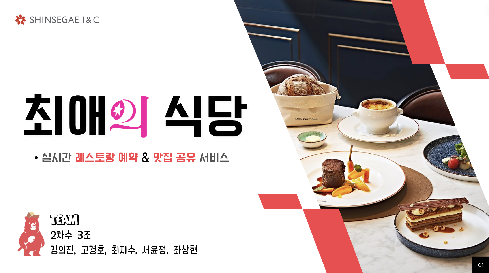

# 최애의 식당

- 배포 URL :  https://eataku.kr/
- Test ID : test
- Test PW : 1234

# 프로젝트 소개

## 현대인의 바쁜 일상 속에서도 간편하게, 실시간 및 날짜 예약과 식당 정보를 손쉽게 공유할 수 있는 ” 스마트 외식 플랫폼”을 소개합니다.

# 팀원 구성

| 고경호                        | 김의진                        | 서윤정                       | 좌상현                                                            | 최지수                       |
|----------------------------|----------------------------|---------------------------|----------------------------------------------------------------|---------------------------|
| 사진    [@yoaruku](https://github.com/yoaruku) | 사진   [@dmlwls12](https://github.com/dmlwls12) | 사진    [@yj0318](https://github.com/yj0318) | 사진    [@sanghyeonJwa](https://github.com/sanghyeonJwa) | 사진   [@jisoo78](https://github.com/jisoo78) |

# 1. 개발 환경

- **Front** : HTML , CSS , JS
- **Back-end** : JAVA , Spring-Boot , Spring Security , Crawling , Python , Selenium
- **Infra** : Naver Cloud Platform , docker , Nginx , Github actions
- **API** : Naver map , coolsms
- **Database** : MySQL , JPA ,MIRO
- **Design** : Figma
- 커밋 컨벤션
- 코드 컨벤션
- 스프라이트

# 2. 채택한 개발 기술과 브랜치 전략

## 브랜치 전략

- **Git-flow** 전략을 기반으로 main,develop 브랜치와 feature 보조 브랜치를 운용했습니다.
  - **main** 브랜치는 배포 단계에서만 사용하는 브랜치 입니다.
  - **develop** 브랜치는 개발 단계에서 git-flow의 master 역할을 하는 브랜치입니다.
  - **feature** 브랜치는 기능 단위로 독립적인 개발 환경을 위하여 사용하고 merge 후 , 각 브랜치를 삭제해 주었습니다.

# 3. 프로젝트 구조

최종 완료되면   인텔리제이에서 뽑기

# 4.역할 분담

## 고경호
- **UI**
  - 페이지 : Header, Footer , 알림 창 , 사용자 회원 가입 페이지
- **기능**
  - 회원 가입 , 알림 , 검색 ,추천
  

## 김의진

- **UI**
    - 페이지 : 레스토랑  페이지 
- **기능**
    - 매장관리 , 예약 관리자 

## 서윤정

- **UI**
    - 페이지 : 예약페이지, 예약 확정 모달창 , 예약 취소 모달창
- **기능**
    -  회원 예약 , 리뷰 등록 

## 좌상현

- **UI**
  - 페이지 : 웨이팅 페이지
- **기능**
  - 회원 웨이팅 , 관리자 웨이팅

## 최지수

- **UI**
    - 페이지 : 리스트 페이지 , 리뷰 페이지
- **기능**
    - 리뷰 수정 및 삭제 , 리스트 생성, 수정 , 삭제

# 5. 개발 기간 및 작업 관리

## 개발기간

- 전체 개발 기간 : 2024-07-19 ~ 2024-09-02
- UI 개발 : 2024-07-29 ~ 2024-08-05
- Backend 개발 : 2024-08-06 ~ 2024-08-30

## 작업 관리

- Notion , Github Projects 와 Issues를 사용하여 진행 사항을 공유 했습니다.
- 주간회의를 진행하며 작업 순서와 방향성에 대한 고민을 나누고 Notion 캘린더에 회의 내용을 기록했습니다.

# 6. 주요 기능

나중에 작성하기 , 일단 시각적인거 무조건 보여주기

# 7. 페이지별 기능

이걸 위키로뺴서 gif 로 만들어서 작성하기 링크를 wiki 로

# 8. 트러블 슈팅

- [예약 이슈](https://github.com/ssg-240304-java2/final-oshi-no-restaurant/wiki/%EC%98%88%EC%95%BD-%EC%9D%B4%EC%8A%88) 
- [웨이팅 이슈](https://github.com/ssg-240304-java2/final-oshi-no-restaurant/wiki/%EC%9B%A8%EC%9D%B4%ED%8C%85-%EC%9D%B4%EC%8A%88)
- [리스트 이슈](https://github.com/ssg-240304-java2/final-oshi-no-restaurant/wiki/%EB%A6%AC%EC%8A%A4%ED%8A%B8-%EC%9D%B4%EC%8A%88)
- [리뷰 이슈](https://github.com/ssg-240304-java2/final-oshi-no-restaurant/wiki/%EB%A6%AC%EB%B7%B0-%EC%9D%B4%EC%8A%88)
- [멤버 이슈](https://github.com/ssg-240304-java2/final-oshi-no-restaurant/wiki/%EB%A9%A4%EB%B2%84-%EC%9D%B4%EC%8A%88)

# 9. 개선목표

# 10.프로젝트 후기

## 고경호

## 김의진

## 서윤정

    여러모로 많은 것들을 배울 수 있었던 한 달이었던 같습니다. 

## 좌상현

## 최지수

