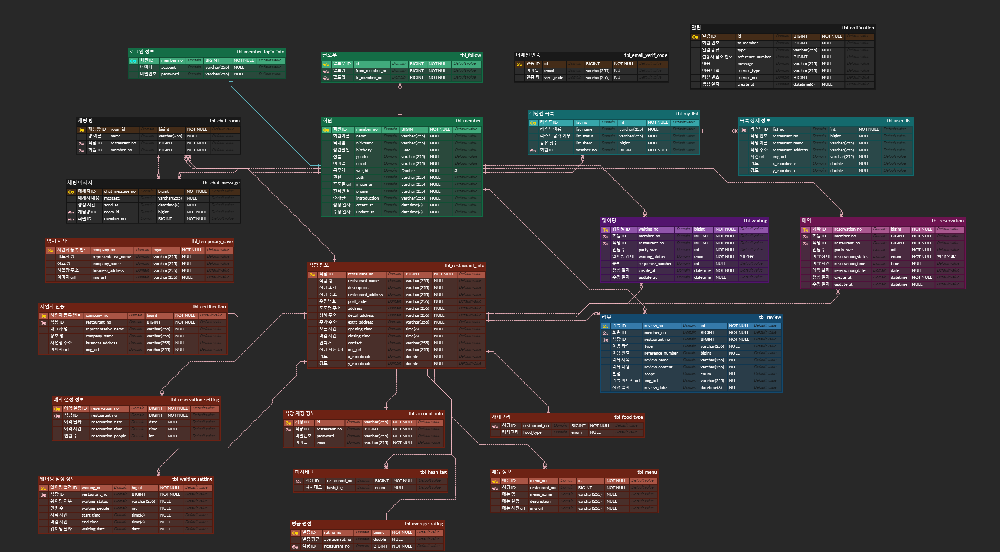

# 최애의 식당

- 배포 URL :  https://eataku.kr/
- Test ID : test
- Test PW : 1234

# 프로젝트 소개

## 현대인의 바쁜 일상 속에서도 간편하게, 실시간 및 날짜 예약과 식당 정보를 손쉽게 공유할 수 있는 ” 스마트 외식 플랫폼”을 소개합니다.

# 팀원 구성

| 고경호                                                                                       | 김의진                                                                                                              | 서윤정                                                                                             | 좌상현                                                                                                          | 최지수                                                                                                |
|-------------------------------------------------------------------------------------------|------------------------------------------------------------------------------------------------------------------|-------------------------------------------------------------------------------------------------|--------------------------------------------------------------------------------------------------------------|----------------------------------------------------------------------------------------------------|
|      [@yoaruku](https://github.com/yoaruku) |    [@dmlwls12](https://github.com/dmlwls12) |   [@yj0318](https://github.com/yj0318) |     [@sanghyeonJwa](https://github.com/sanghyeonJwa) |     [@jisoo78](https://github.com/jisoo78) |

# 1. 개발 환경

- **Front** : HTML , CSS , JS
- **Back-end** : JAVA , Spring-Boot , Spring Security , Crawling , Python , Selenium
- **Infra** : Naver Cloud Platform , docker , Nginx , Github actions
- **API** : Naver map , coolsms
- **Database** : MySQL , JPA ,MIRO
- **Design** : Figma
- [커밋 컨벤션](https://github.com/ssg-240304-java2/final-oshi-no-restaurant/wiki/%EC%BB%A4%EB%B0%8B-%EC%BB%A8%EB%B2%A4%EC%85%98-&-%EA%B9%83-%ED%94%8C%EB%A1%9C%EC%9A%B0)

# 2. 채택한 개발 기술과 브랜치 전략

## 브랜치 전략

- **Git-flow** 전략을 기반으로 main,develop 브랜치와 feature 보조 브랜치를 운용했습니다.
  - **main** 브랜치는 배포 단계에서만 사용하는 브랜치 입니다.
  - **develop** 브랜치는 개발 단계에서 git-flow의 master 역할을 하는 브랜치입니다.
  - **feature** 브랜치는 기능 단위로 독립적인 개발 환경을 위하여 사용하고 merge 후 , 각 브랜치를 삭제해 주었습니다.

# 3. 프로젝트 구조

# 4.역할 분담

## 고경호
- **UI**
  - 페이지 : Header, Footer , 알림 창 , 사용자 회원 가입 페이지
- **기능**
  - 회원 가입 , 알림 , 검색 ,추천
  

## 김의진

- **UI**
    - 페이지 : 레스토랑  페이지 
- **기능**
    - 매장관리 , 예약 관리자 

## 서윤정

- **UI**
    - 페이지 : 예약페이지, 예약 확정 ,예약 취소 , 상세 페이지
- **기능**
    -  회원 예약 , 리뷰 등록 

## 좌상현

- **UI**
  - 페이지 : 웨이팅 페이지
- **기능**
  - 회원 웨이팅 , 관리자 웨이팅

## 최지수

- **UI**
    - 페이지 : 리스트 페이지 , 리뷰 페이지
- **기능**
    - 리뷰 수정 및 삭제 , 리스트 생성, 수정 , 삭제

# 5. 개발 기간 및 작업 관리

## 개발기간

- 전체 개발 기간 : 2024-07-19 ~ 2024-09-02
- UI 개발 : 2024-07-29 ~ 2024-08-05
- Backend 개발 : 2024-08-06 ~ 2024-08-30
- ERD 개발 : 2024-07-30 ~ 2024-08-02

## 6. ERD

## 7.작업 관리

- [Notion](https://coffit23.notion.site/3-oshi_no_restaurant-4deeb7b1685547cc96e80c2256969737) , Github Projects 와 Issues를 사용하여 진행 사항을 공유 했습니다.
- 주간회의를 진행하며 작업 순서와 방향성에 대한 고민을 나누고 Notion 캘린더에 회의 내용을 기록했습니다.

## 8. 주요 기능

## 회원, 매장 , 소셜 로그인

## 웨이팅 등록과 리뷰 등록

## 예약 등록 및 예약 취소

## 리뷰 작성

## 리스트 작성

# 9. 트러블 슈팅

- [예약 이슈](https://github.com/ssg-240304-java2/final-oshi-no-restaurant/wiki/%EC%98%88%EC%95%BD-%EC%9D%B4%EC%8A%88) 
- [웨이팅 이슈](https://github.com/ssg-240304-java2/final-oshi-no-restaurant/wiki/%EC%9B%A8%EC%9D%B4%ED%8C%85-%EC%9D%B4%EC%8A%88)
- [리스트 이슈](https://github.com/ssg-240304-java2/final-oshi-no-restaurant/wiki/%EB%A6%AC%EC%8A%A4%ED%8A%B8-%EC%9D%B4%EC%8A%88)
- [리뷰 이슈](https://github.com/ssg-240304-java2/final-oshi-no-restaurant/wiki/%EB%A6%AC%EB%B7%B0-%EC%9D%B4%EC%8A%88)
- [멤버 이슈](https://github.com/ssg-240304-java2/final-oshi-no-restaurant/wiki/%EB%A9%A4%EB%B2%84-%EC%9D%B4%EC%8A%88)

# 10. 개선목표
  - 웹 사이드 디자인 구조 변경
      웹 사이트만을 기준으로 하는 것이 아닌 모바일 환경에서도 한 눈에 확인 할 수 있는 디자인으로 개발
  - 프로젝트 구조 및 코드 리팩토링
      프로젝트 구조 더 명확하게 변경 및 코드 재사용성 증가 목표
  - 기술적 보완 및 구조 개선 
      엘라스틱 서치 등 더 수준있는 기술을 써서 개발 수준 향상

# 11.프로젝트 후기

## 고경호
    Spring Security를 처음 사용해보며 예상보다 어려움을 겪었지만, 팀원들의 도움 덕분에 
    결국 모든 기능을 제때 구현할 수 있었습니다. 팀원들과의 협업을 통해 즐거운 
    경험을 할 수 있었습니다. 많은 배움과 성장을 가져다준 기회였습니다.

## 김의진
    팀원의 개발 일정을 관리함으로써 프로젝트 관리 능력을 기를 수 있었습니다. 
    기획한 기능을 모두 다 개발하지 못한 점이 아쉽지만 기능을 상중하로 나누어서
    개발한 점이 크게 도움이 되어 주요 기능 대부분을 개발할 수 있었습니다. 
    취업 후에 팀에 들어가 개발을 할 때 좋은 경험이 될 것 같습니다.

## 서윤정
    시나리오대로 구현한 점은 좋았지만 아쉬운 점은 시나리오 외적인 상황에 대해
    충분히 고려하지 못했다는 것입니다. 이로 인해 예기치 않은 상황에 대비하거나 
    즉각적으로 대응하는 데 어려움이 있었습니다. 앞으로는 시나리오 내의 계획을 철저히
    준비하는 것뿐만 아니라, 다양한 가능성을 염두에 두고 예상치 못한 상황에서도 
    유연하게 대처할 수 있는 능력을 기르는 것이 중요하다는 것을 느꼈습니다. 

## 좌상현
    긴 시간동안 프로젝트의 시작과 끝을 경험 할 수 있어서 좋았습니다. 
    팀원들과 소통하고 갈등을 해결하는 방법을 배웠고, 새로운 기술을 사용해보고 
    문제점들을 해결하면서 한층 더 성장한 것 같습니다. 

## 최지수
    약 4~5주간 프로젝트를 진행하면서 설계를 하는 부분에서부터 api 사용, 
    구조 설계 등등 사용하는 데 있어 어려움을 많이 겪었지만 팀원들과 협력을 통해 서로의 
    부족한 점을 메꾸면서 협력하는 과정이 정말 즐거웠습니다 이번 프로젝트를 통해 이전보다 
    백엔드를 이해하는 능력이 크게 향상되었고 새로운 관점에서 문제를 바라보는 것도 
    필요하다고 느꼈습니다 프로젝트를 하면서 같이 협력해 준 팀원들에게 고마움을 느끼고 
    파이널 프로젝트가 큰 성장에 계기가 되었으면 합니다 

